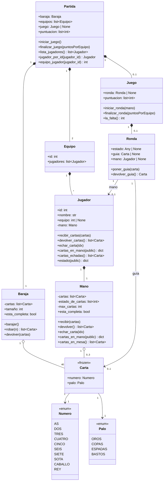

# Diagrama de clases - Dominio (Truque)

Diagrama de clases de `src/dominio/`.

```mermaid
classDiagram
    class Partida {
        +baraja: Baraja
        +equipos: list~Equipo~
        +juego: Juego | None
        +puntuacion: list~int~
        +iniciar_juego()
        +finalizar_juego(puntosPorEquipo)
        +lista_jugadores() list~Jugador~
        +jugador_por_id(jugador_id) Jugador
        +equipo_jugador(jugador_id) int
    }

    class Juego {
        +ronda: Ronda | None
        +puntuacion: list~int~
        +iniciar_ronda(mano)
        +finalizar_ronda(puntosPorEquipo)
        +la_falta() int
    }

    class Ronda {
        +estado: Any | None
        +guia: Carta | None
        +mano: Jugador | None
        +poner_guia(carta)
        +devolver_guia() Carta
    }

    class Equipo {
        +id: int
        +jugadores: list~Jugador~
    }

    class Jugador {
        +id: int
        +nombre: str
        +equipo: int | None
        -mano: Mano
        +recibir_cartas(cartas)
        +devolver_cartas() list~Carta~
        +echar_carta(idx)
        +cartas_en_mano(public) dict
        +cartas_echadas() list~Carta~
        +estado(public) dict
    }

    class Mano {
        -cartas: list~Carta~
        -estado_de_cartas: list~int~
        -max_cartas: int
        +recibir(cartas)
        +devolver() list~Carta~
        +echar_carta(idx)
        +cartas_en_mano(public) dict
        +cartas_en_mesa() list~Carta~
        +esta_completa: bool
    }

    class Baraja {
        -cartas: list~Carta~
        +tamaño: int
        +esta_completa: bool
        +barajar()
        +robar(n) list~Carta~
        +devolver(cartas)
    }

    class Carta {
        <<frozen>>
        +numero: Numero
        +palo: Palo
    }

    class Numero {
        <<enum>>
        AS
        DOS
        TRES
        CUATRO
        CINCO
        SEIS
        SIETE
        SOTA
        CABALLO
        REY
    }

    class Palo {
        <<enum>>
        OROS
        COPAS
        ESPADAS
        BASTOS
    }

    Partida "1" *-- "1" Baraja
    Partida "1" *-- "2" Equipo
    Partida "1" *-- "0..1" Juego
    Juego "1" *-- "0..1" Ronda
    Equipo "1" *-- "*" Jugador
    Jugador "1" *-- "1" Mano
    Baraja "1" o-- "40" Carta
    Mano "1" o-- "0..3" Carta
    Ronda "1" --> "0..1" Jugador : mano
    Ronda "1" --> "0..1" Carta : guía
    Carta "1" --> "1" Numero
    Carta "1" --> "1" Palo
```
